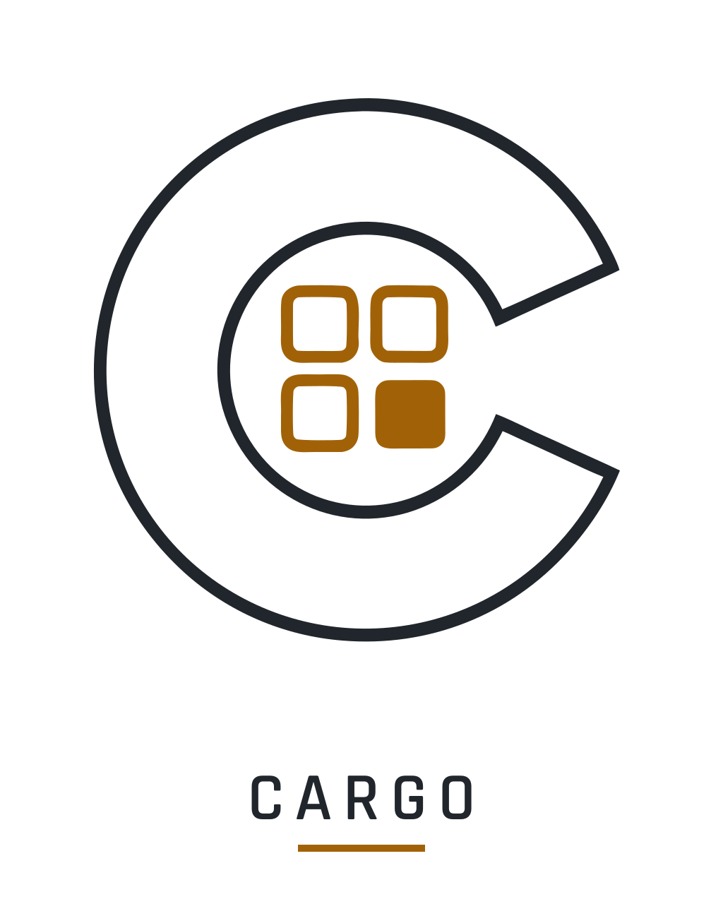

  <picture>
    <source media="(prefers-color-scheme: dark)" srcset="assets/cargo_lockup_dark.svg">
    
  </picture>

# Cargo

Módulo de **inventario** del ecosistema [Corpus](https://github.com/Sepuldosky/corpus) para
**Garry's Mod**: grid estilo STALKER/GAMMA, framework de ítems, equipamiento con holster,
peso→movimiento, contenedores y puente de attachments ARC9. Addon independiente que
**hard-depende** de Corpus (la única dependencia dura del ecosistema) y detecta a los demás
módulos en runtime, nunca los asume. Es sobre todo un **hub de consumo** —los otros módulos
registran sus ítems (médicos, consumibles) contra el framework que Cargo expone—, pero **no
es hoja** en el grafo: también consume Coagulant (drenaje de stamina por sobrepeso) y Cortex
(facción/rango del header), ambos con lazy-check y degradación honesta.

**Regla de diseño:** Cargo posee el "cómo se define, pesa, guarda y renderiza" un ítem; el
módulo dueño posee el "qué hace". Cargo transporta blobs de instancia sin interpretarlos.

## Características

- **Grid uniforme por gradas** con footprint `w×h` por ítem, íconos renderizados en vivo
  (RT + caché en disco) y editor de encuadre; overlays de condición/stack por esquina.
- **Framework de ítems** con dos clases, categorías, stacks (fusión solo con condición
  idéntica), sub-slots genéricos (placas, ópticas, exo) con eyección obligatoria al destruir.
- **UI fullscreen 3 columnas / 3 estados** (Solo/Loot/Trade) + tooltip de
  inspección, feed de pickup y **wheel menu radial** (hold de G) sobre las teclas 1-7.
- **Equipamiento estilo STALKER**: slots de arma por tecla 1-7, re-apretar enfunda (SWEP de
  manos propio), quick slots F1-F4, slot de granadas por stack (`×N`), drop directo desde el
  slot, spawn desarmado — la captura convierte las armas del engine en ítems (incluidas las
  herramientas del spawnmenu) y los drops son el SWEP real en mundo.
- **El cinturón ES la reserva de munición**: los tipos de HL2 son ítems, espejo agnóstico de
  base (cero hooks de ARC9), armas del mismo tipo comparten reserva.
- **Peso → velocidad** (curva pura, capacidad base + mochila), dinero con provider nativo,
  contenedores en mundo con transferencias.
- **Comercio (slice 1)**: el trader ES un contenedor con una capa de precio (mismo
  primitivo, no un inventario paralelo); precio = `value × condición × spread`, basket de
  intent puro en el cliente y `Confirm` atómico en el servidor. Sin `value`, un ítem no
  está a la venta.
- **Theme con paletas runtime**: base neutra estilo spawnmenu que se tiñe en vivo con el
  preset del HUD DGL4 si está montado; paleta GAMMA disponible por convar.
- **Puente ARC9**: attachments viven en el inventario, stats en vivo vía `GetProcessedValue`,
  reconciliación con el menú C. Degrada con gracia si ARC9 no está.
- **Persistencia completa** por SteamID64 vía `Corpus.Data` — inventario, equipadas,
  cargadores e instancias sobreviven reinicio y reconexión.

En diseño / sin implementar: **Workbench** (craft/reparación/desarme). Del comercio
(`Cargo_Trade`) falta el slice 2 (dinero como entidad: botarlo, ofrecerlo en el basket) y
el slice 3 (jugador-trader con doble confirmación).

## Requisitos

- **Corpus** (dependencia dura — sin él, Cargo no arranca).
- Opcional: **ARC9** (attachments + stats en vivo) y **DGL4** (la UI se tiñe con el preset
  del HUD). Cargo degrada con gracia si no están.

El idioma de cara al jugador (UI, ítems, menús) es **inglés**; docs y commits en español.

## Documentación

- [`docs/Cargo_Architecture.md`](docs/Cargo_Architecture.md) — arquitectura del módulo (inventario, contrato de ítems).
- [`docs/Cargo_ItemImages_Arquitectura.md`](docs/Cargo_ItemImages_Arquitectura.md) — sistema de imágenes de ítems.
- [`docs/Cargo_Trade_Arquitectura.md`](docs/Cargo_Trade_Arquitectura.md) — comercio (slice 1 en producción; slices 2-3 en diseño).
- [`docs/Workbench_Arquitectura.md`](docs/Workbench_Arquitectura.md) — banco de trabajo (subsistema futuro, sin código).
- [`docs/cargo_estado.md`](docs/cargo_estado.md) · [`docs/cargo_roadmap.txt`](docs/cargo_roadmap.txt) · [`docs/CHANGELOG.md`](docs/CHANGELOG.md) — docs vivos.
- [`CLAUDE.md`](CLAUDE.md) — guía para asistencia con Claude Code.

## Créditos

- El SWEP **"Hands"** (estado desarmado por defecto) es un port de
  [*Apex Legends: Holster/Melee SWEP*](https://steamcommunity.com/sharedfiles/filedetails/?id=2792160770)
  de **Twilight Sparkle & Buu342** (con créditos a Internet Overdoser, V92 y WebKnight;
  animaciones de Respawn Entertainment). El mod **no declara licencia** y está sin
  mantenimiento desde hace años; **no hay permiso explícito de sus autores**. Se recicla
  bajo la política estándar de la comunidad: **créditos completos preservados** y
  **retiro inmediato de los assets si sus autores lo piden** — escribinos y se saca.
  Cambios sobre el original: clase renombrada al namespace del módulo para que ambos
  addons coexistan montados, y fix propio de iluminación del viewmodel (brazos oscuros).
- Los íconos de armas **ARC9** reutilizan el select icon que genera el propio ARC9
  (COMPAT-RUNTIME: se consume su salida por API, no se copia código).
